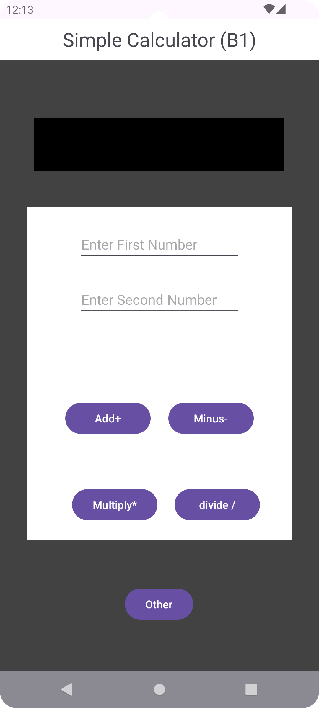

# Simple_Calculator Repository
This repository contains the source code for our simple calculator.

## Prerequisites

Before getting started, ensure you have the following prerequisites installed on your system:

- Git: [Download & Install Git](https://git-scm.com/downloads)
- Android Studio: [Download & Install Android Studio](https://developer.android.com/studio)

## Clone the Repository

To clone this repository to your local machine, use the following command in your terminal or Git Bash:

```bash
git clone https://github.com/shyam9493/simple_calculator.git
```
## Running the App
1.Connect a Device or Start an Emulator: You can run the app on a physical device connected to your computer via USB or use an Android Emulator provided by Android Studio.

2.Build and Run: Once your device is connected or the emulator is started, click on the green play button in the toolbar or select Run > Run 'app' from the menu.

3.Wait for Installation: Android Studio will build the project and install the app on your device or emulator. Once the installation is complete, you should see the app running.



